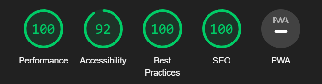

# Web 3.0 Project

# The mission

- Write meaningful, semantically correct HTML
- Use modern positioning techniques using the `grid` or `flexbox` model
- Create a "pixel-perfect" integration from a given wireframe

For this project, I had to tackle a Frontend Mentor design : [News Homepage](https://www.frontendmentor.io/challenges/news-homepage-H6SWTa1MFl).

## What I used

- B.E.M.
- SASS (scss)
- Semantic HTML
- Responsive design
- Javascript Vanilla for the Hamburger menu

## Lighthouse Report

### Desktop Report

### Mobile report

## Github Page

At the end of the project, you have to publish your page as a Github page.

[My project](https://junior-dev-track.github.io/14-css-web-3-0-project-crolette/)
